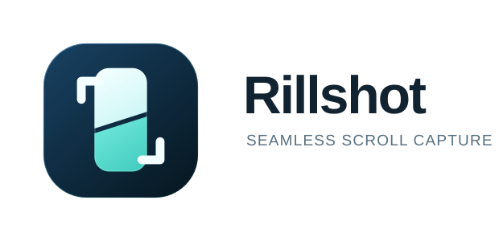
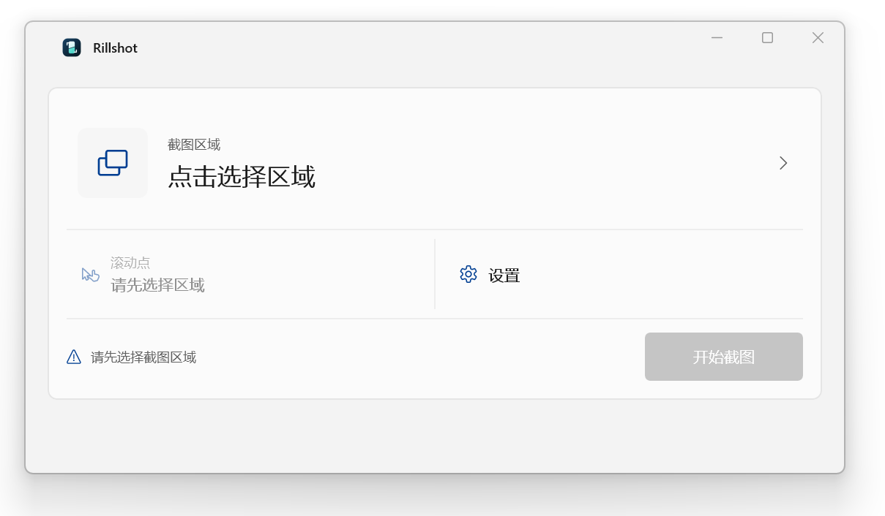

<p align="center">
  
</p>

<p align="center">原生、快速、简洁的 Windows 11 长截图工具</p>

<p align="center">
  <a href="../../releases/latest">下载</a> ·
  <a href="#适用场景">适用场景</a> ·
  <a href="#使用方法">使用方法</a> ·
  <a href="#命令行接口">命令行接口</a> ·
  <a href="#从源码构建">从源码构建</a> ·
  <a href="CONTRIBUTING.md">参与贡献</a>
</p>

# Rillshot

Rillshot 用于补充 Windows 自带截图工具在滚动长截图方面的功能空缺。它连续捕获并拼接屏幕中的指定区域，将需要滚动查看的内容保存为一张长图。

Rillshot 使用 C++/WinRT 和 WinUI 3 构建，界面遵循 Windows 11 的原生设计。除图形界面外，项目还提供独立 CLI，可由终端、脚本和 Agent 工具调用。

<p align="center">
  
</p>

## 适用场景

Rillshot 最初面向金山文档、飞书文档等云文档场景。这些页面常将正文放在内部滚动容器中，浏览器自带的整页截图可能无法识别或完整捕获其中的内容。Rillshot 直接捕获屏幕上的指定区域，并通过滚轮或键盘驱动内容滚动，不依赖网页自身的滚动结构。你也可以在Word文档等场景使用。

## 功能

- 向上或向下拼接长截图
- 原生 WinUI 3 界面，支持浅色、深色和系统主题
- 自动等待画面稳定并拼接相邻截图
- 鼠标滚轮、翻页键、空格键和方向键滚动
- PNG 和 BMP 输出
- 固定页头和页脚排除
- DXGI 捕获和 GDI 兼容模式
- 全局快捷键
- 可供脚本和 Agent 工具调用的命令行接口

## 系统要求

- 64 位 Windows 11
- x64 处理器
- 目标内容能够在 Windows 桌面显示，并能响应所选滚动方式

其他 Windows 版本尚未列入支持范围。

## 下载和运行

1. 从 [Releases](../../releases/latest) 下载 x64 Portable 压缩包。
2. 将压缩包完整解压到具有写入权限的目录。
3. 运行根目录中的 `Rillshot.exe`。

Portable 版本将截图、设置和启动日志保存在解压目录的 `app` 子目录中。移动或删除程序前，请先备份需要保留的截图。

## 使用方法

1. 打开目标页面。
2. 在 Rillshot 中选择截图区域。
3. 在正文区域选择滚动点。
4. 按需调整滚动方向、滚动方式、捕获帧数、滚动步数和固定页头高度。
5. 选择保存位置，然后点击“开始截图”或按 `Ctrl+Enter`。
6. 截图完成后，可打开图片、定位文件或复制文件路径。

默认全局快捷键为 `Ctrl+Alt+S`，用于选择截图区域。截图期间不要移动目标窗口或遮挡截图区域。使用键盘滚动时，应保持目标页面处于前台。

## 命令行接口

Portable 包根目录中的 `rillshot-cli.exe` 可供终端、脚本和 Agent 工具调用。以下命令按物理像素坐标截图，并将结果状态以 UTF-8 JSON 写入标准输出：

```powershell
./rillshot-cli.exe capture `
  --region 100,100,900,700 `
  --scroll-point 550,700 `
  --out ./captures/page.png `
  --json
```

`--region` 的格式为 `x,y,width,height`。`--scroll-point` 可省略，默认位于截图区域内靠近滚动方向的一侧。多显示器坐标可以为负数。

默认情况下，CLI 不替换已有输出及其辅助文件。确需替换时应显式传入 `--overwrite`。

```powershell
./rillshot-cli.exe --version
./rillshot-cli.exe capture --help
```

退出码如下：

| 退出码 | 含义 |
|---:|---|
| `0` | 截图以正常停止原因结束 |
| `1` | 截图或进程初始化失败 |
| `2` | 命令行参数错误 |

带有 `--json` 时，一次已执行的截图只向标准输出写入一个 JSON 对象。参数错误和初始化错误写入标准错误。JSON 中包含 `schemaVersion`、`ok`、`exitCode`、`stopReason`、帧数、接缝数及输出文件状态。

## 常见问题

截图提前停止通常由以下情况引起：页面没有继续滚动，滚动点不在正文区域，视频或广告持续变化，重叠内容不足，固定元素遮挡正文，或目标窗口的权限高于 Rillshot。

可依次尝试减小滚动步数、重新选择滚动点、暂停动态内容、设置固定页头高度、切换兼容模式或缩小截图区域。

输出目录可能包含以下辅助文件：

| 文件 | 说明 |
|---|---|
| `*.partial.png` | 停止前已经完成的部分 |
| `*.comparison.png` | 最后一个未通过接缝检查的画面 |
| `*.jsonl` | 捕获参数、过程和停止原因 |

诊断文件可能包含本地路径或页面内容。提交问题前请先检查文件内容。

## 从源码构建

需要以下环境：

- Visual Studio 2026 18.7 或更高版本
- “使用 C++ 的桌面开发”和“Windows 应用开发”工作负载
- Windows SDK、MSBuild C++ 工具和 CMake
- CMake 4.2 或更高版本

CppWinRT 工具对非 ASCII 响应文件路径的兼容性有限。建议将源码放在较短的纯 ASCII 路径下，例如 `D:\src\Rillshot`。在源码根目录运行：

```bat
build-release.cmd
```

该命令运行核心测试，构建 CLI 和 WinUI，并执行启动检查。Preview Portable 包生成在 `artifacts\release`。

只运行平台无关测试时，可在 Developer PowerShell for Visual Studio 中执行：

```powershell
cmake -S . -B out/build/core-msvc -A x64 `
  -DRILLSHOT_BUILD_TESTS=ON `
  -DRILLSHOT_BUILD_WINDOWS_APPS=OFF `
  -DRILLSHOT_WARNINGS_AS_ERRORS=ON
cmake --build out/build/core-msvc --config Release --parallel
ctest --test-dir out/build/core-msvc -C Release --output-on-failure
```

## 工程结构

| 路径 | 内容 |
|---|---|
| `src/core`、`src/stitch` | 图像数据、指标和拼接算法 |
| `src/session` | 捕获流程、停止语义和诊断 |
| `src/capture`、`src/input`、`src/output` | Windows 捕获、输入和图片写入 |
| `src/cli`、`apps/rillshot_cli` | 命令行参数契约和程序入口 |
| `src/gui` | 共享界面状态和 Windows 交互 |
| `apps/rillshot_winui` | C++/WinRT WinUI 3 前端 |
| `apps/rillshot_launcher` | Portable 图形界面启动器 |
| `tests` | 核心算法与行为测试 |
| `tools` | 构建、打包和启动测试脚本 |

## 参与贡献

欢迎提交缺陷报告、测试、文档修正和范围明确的代码改进。开始前请阅读 [贡献指南](CONTRIBUTING.md) 和 [行为准则](CODE_OF_CONDUCT.md)。安全问题请按 [安全政策](SECURITY.md) 报告。

用户可见的变化应同步更新 [变更记录](CHANGELOG.md)。维护者发布版本时请按 [发布指南](RELEASING.md) 操作。

## 许可证

除第三方文件或另有标注外，Rillshot 社区版采用 [`GPL-3.0-only`](LICENSE) 许可证。分发二进制时还应遵守 [对应源码说明](SOURCE_OFFER.md) 和 [第三方通知](THIRD_PARTY_NOTICES.txt)。商业授权信息见 [商业许可说明](COMMERCIAL-LICENSE.md)，名称和图形标志的使用规则见 [商标说明](TRADEMARKS.md)。
